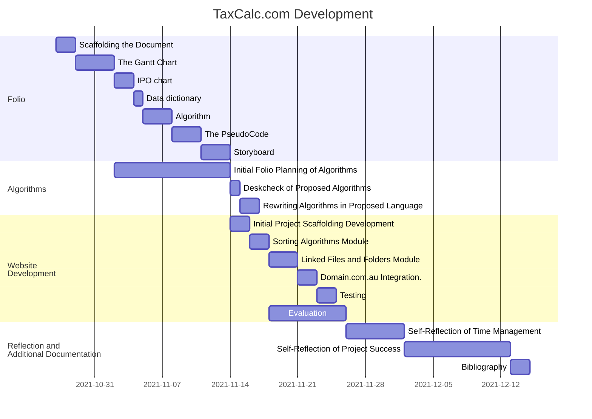
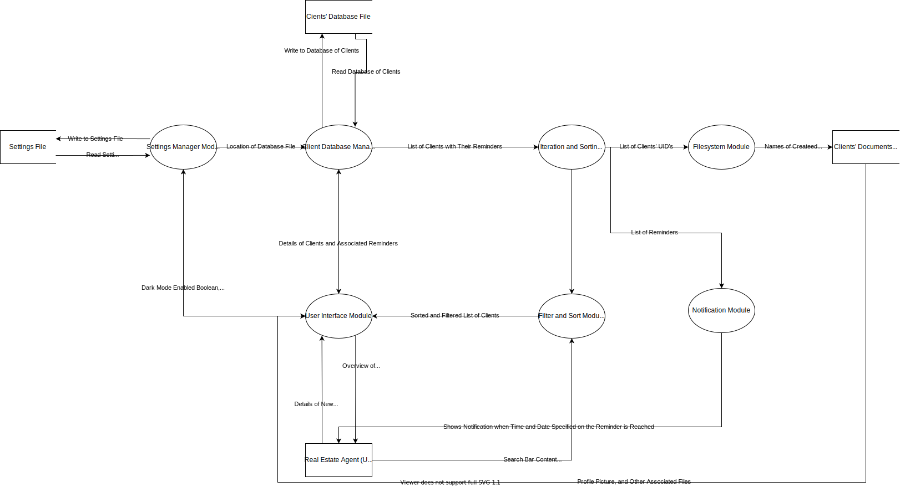

# Documentation for Project
## Modules
- [Module 1](./module-1)
- [Module 2](./module-2)

## Gant

```mermaid
gantt
    dateFormat  YYYY-MM-DD
    title TaxCalc.com Development
    %% (`excludes` accepts specific dates in YYYY-MM-DD format, days of the week ("sunday") or "weekends", but not the word "weekdays".)
	
	section Folio
	Scaffolding the Document:initalscaffolding, 2021-10-27, 2d
    The Gantt Chart:initalplanning, after initalscaffolding, 4d
    IPO chart: 2d
    Data dictionary: 1d
    Algorithm : 3d
    The PseudoCode : 3d
    Storyboard :3d
	
	section Algorithms
	Initial Folio Planning of Algorithms :a1, after initalplanning, 12d
	Deskcheck of Proposed Algorithms :a2, after a1, 1d
    Rewriting Algorithms in Proposed Language : 2d
    
    section Website<br>Development
    Initial Project Scaffolding Development:after a1, 2d
	
    Sorting Algorithms Module : 2d
    Linked Files and Folders Module : 3d
    Domain.com.au Integration. : 2d
    Testing : 2d
    Evaluation : 2021-11-18, 2021-11-26
    
	section Reflection and<br>Additional Documentation
	Self-Reflection of Time Management: 2021-11-26, 2021-12-02
	Self-Reflection of Project Success: 2021-12-02, 2021-12-13
	Bibliography: 2021-12-13, 2021-12-15
```

## Data Flow Diagram

## Structure Chart

