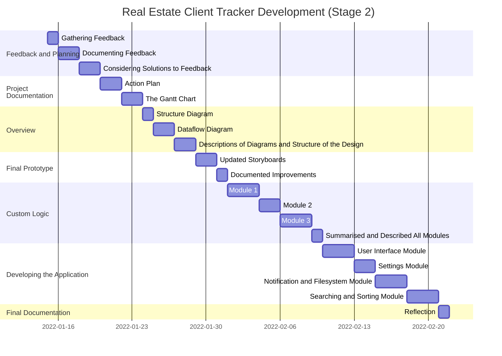
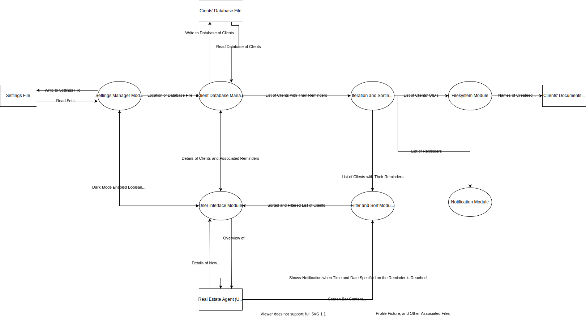

# Stage 2
## Modules
- [Module 1](./module-1)
- [Module 2](./module-2)

## Gantt

```mermaid
gantt
    dateFormat  YYYY-MM-DD
    title Real Estate Client Tracker Development (Stage 2)
    %% (`excludes` accepts specific dates in YYYY-MM-DD format, days of the week ("sunday") or "weekends", but not the word "weekdays".)
	
	section Feedback and Planning
	Gathering Feedback:initalscaffolding, 2022-01-15, 1d
    Documenting Feedback:initalplanning, after initalscaffolding, 2d
    Considering Solutions to Feedback: 2d
    
	section Project<br>Documentation
    Action Plan: 2d
    The Gantt Chart: 2d

	section Overview
	Structure Diagram : 1d
    Dataflow Diagram : 2d
    Descriptions of Diagrams and Structure of the Design: 2d
    
    section Final Prototype
	Updated Storyboards: 2d
    Documented Improvements: 1d

    section Custom Logic
    Module 1: 3d
    Module 2: 2d
    Module 3: 3d
    Summarised and Described All Modules: 1d

    section Developing the Application
    User Interface Module: 3d
    Settings Module: 2d
    Notification and Filesystem Module: 3d
    Searching and Sorting Module: 3d

    section Final Documentation
    Reflection: 1d
```

## Data Flow Diagram

## Structure Chart

## Storyboard

