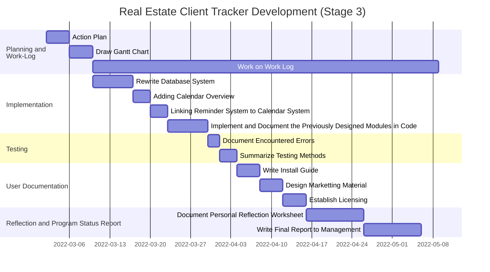

# Stage 3
## Gantt

```mermaid
gantt
    dateFormat  YYYY-MM-DD
    title Real Estate Client Tracker Development (Stage 3)
    %% (`excludes` accepts specific dates in YYYY-MM-DD format, days of the week ("sunday") or "weekends", but not the word "weekdays".)
	
	section Planning and<br>Work-Log
    Action Plan :a1, 2022-03-02, 4d
    Draw Gantt Chart :a2, after a1, 4d
    Work on Work Log :60d

    section Implementation
    Rewrite Database System :after a2, 7d
    Adding Calendar Overview :3d
    Linking Reminder System to Calendar System: 3d
    Implement and Document the Previously Designed Modules in Code :7d

    section Testing
    Document Encountered Errors :2d
    Summarize Testing Methods: 3d

    section User Documentation
    Write Install Guide: 4d
    Design Marketting Material: 4d
    Establish Licensing: 4d

    section Reflection and Program Status Report
    Document Personal Reflection Worksheet: 10d
    Write Final Report to Management: 10d
```

## Install Guide
[Install Guide](./install-guide.md)